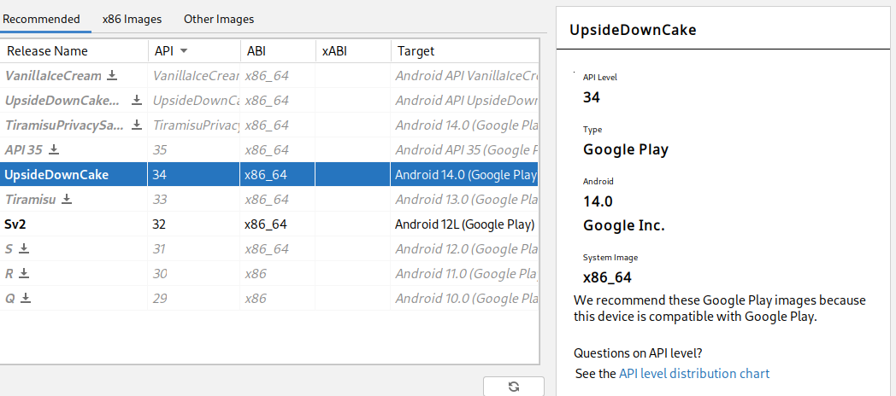
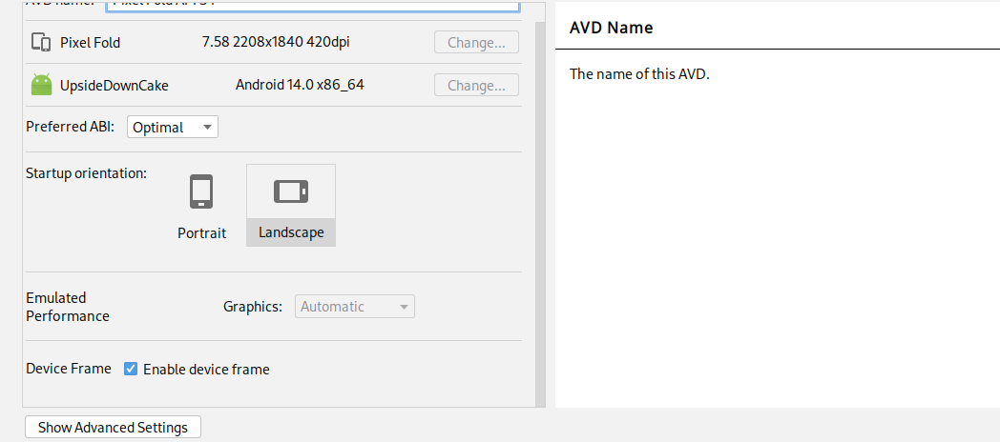
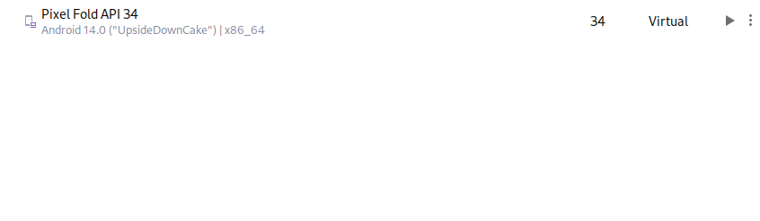
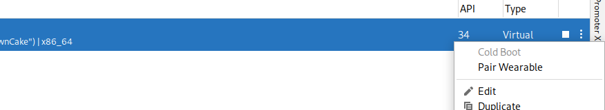
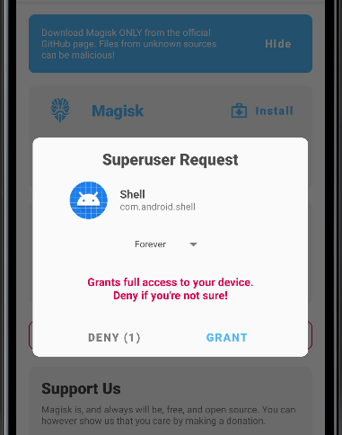

# ubiquitous-pancake
WhatsApp VoIP call recorder created for educational purposes.

The system will consist of a c&c server and an agent. The agent is installed on the system and has root access and starts automatically at system startup and is not visible to the user. It waits for commands from the server. If the server requests call recording, the agent goes into tracking mode. When a call starts, the agent starts recording and temporarily stores the file on the device in encrypted form. When the call ends, the file is sent to the server and deleted from the device. The server decrypts the recording and it can be listened to through a regular player.

# Solving approach 
I decided to break the task into subtasks and for each of them I will write separate small applications.

## Capturing of sound (Done)
The audio capture uses tinyalsa, tinymix and tinycap. This allows capturing sound from the speaker and microphone without asking for permission from the user, since the capture takes place below the android framework level. I wraped tinymix & tinysound in library for use them from jni.

Sample: [CallCapturer](https://github.com/shriwand/ubiquitous-pancake/tree/main/CallCapturer)

## No activity application (Done)
A non-activated application that runs in the background. Use Android Service & BroadcastReciver.

Sample: [Agent](https://github.com/shriwand/ubiquitous-pancake/tree/main/agent)

## Detecting whatsapp calls (WIP)
The application detects the start and end of Whatsapp call using android telephony services and displays messages about it in logcat. 

## C&C server (WIP).
WIP

## Full agent (WIP).
Full functionall agent.


# Setting up the emulator

Use android emulator because of availability & simplicity in terms of OS recovering.

## AVD creation

Use Android 14.0 ("UpsideDownCake") provided by Google.







## Rooting the emulator
Use [this project](https://gitlab.com/newbit/rootAVD) for getting root access for the emulator.
There is [an instruction](https://samsclass.info/128/proj/M142.htm) how to use root the emulator on different OSs using *rootAVD*.

Steps: 
1. Enable Developer Options & USB debugging.
2. Get *rootAVD*: `git clone https://gitlab.com/newbit/rootAVD && cd rootAVD`
3. Install *Magisk*: 
```sh
export PATH=$PATH:~/Android/Sdk/platform-tools/
./rootAVD.sh system-images/android-34/google_apis_playstore/x86_64/ramdisk.img
```
4. Cold Boot the emulator .
5. Open & install *Magisk* 
6. `adb shell su` and allow superuser request in the emulator. 

In case of issues see [the instruction](https://samsclass.info/128/proj/M142.htm).

## WhatsApp installation.
Install WhatsApp from Google Play.

## Setup capturing of calls (first sample usage)
- Bulid project [CallCapturer](https://github.com/shriwand/ubiquitous-pancake/tree/main/CallCapturer) in AndroidStudio.
- Install the apk * app/build/outputs/apk/debug/app-debug.apk* for root
  ```sh
  adb push app/build/outputs/apk/debug/app-debug.apk
  adb shell
  su
  pm install --user 0 app-debug.apk```
- Launch the apk.
- Call using whatsapp.
- Close tha apk after call.
- Recorded call will be in */sdcard/Downloads/call_recording.wav*
